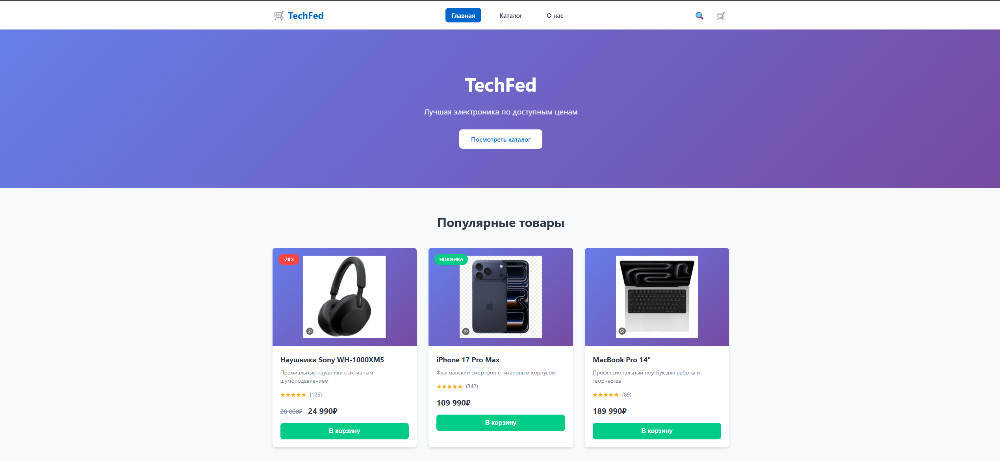
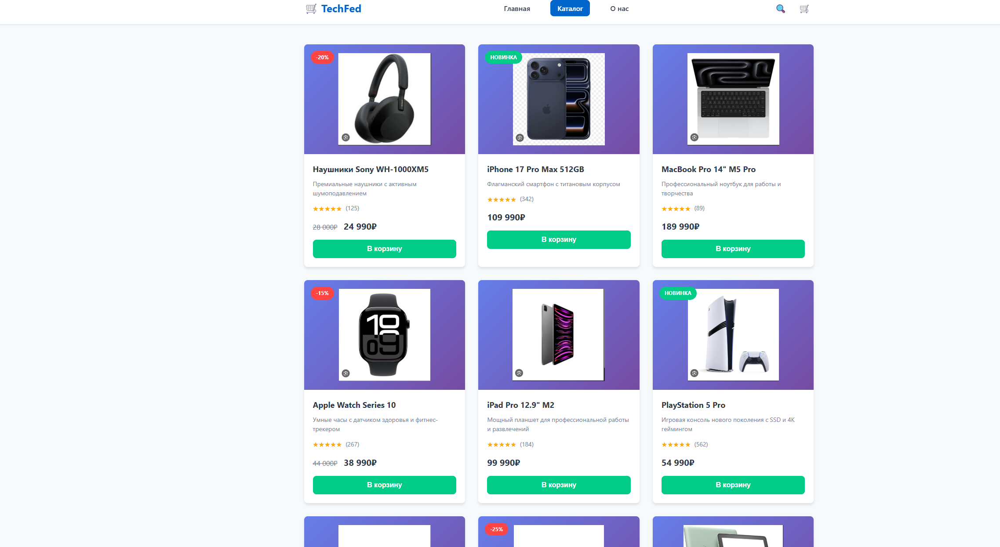
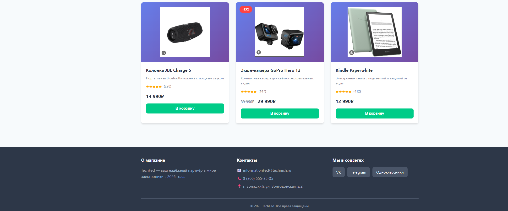
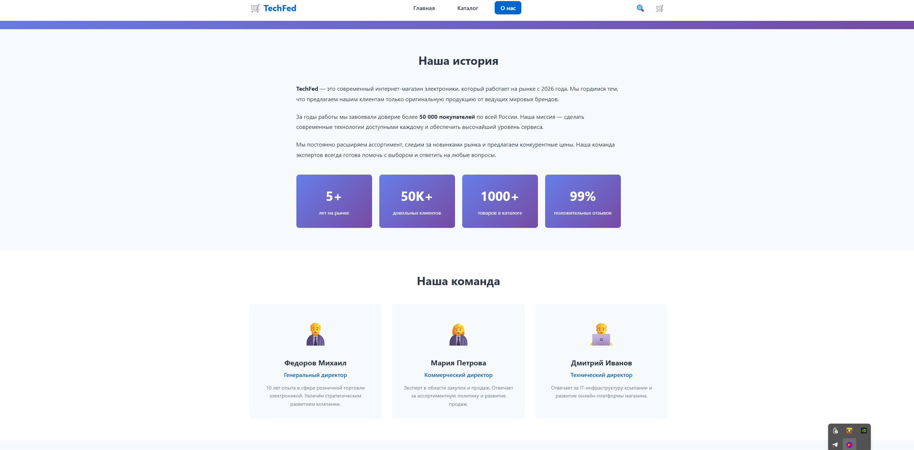
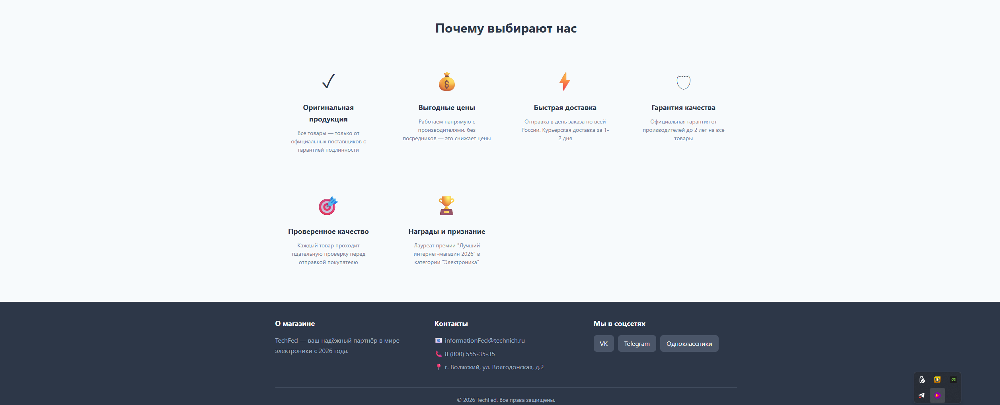

# Лабораторная работа №14-16 - Интернет-магазин "TechFed"

**ФИО:** Федоров Михаил Дмитриевич  
**Группа:** ИСП-233  
**Дата:** 22.03.2026

## Описание проекта
Многостраничный сайт интернет-магазина электроники "TechFed" с адаптивной вёрсткой. Проект демонстрирует навыки создания современных веб-интерфейсов с использованием семантической разметки и современных техник CSS.

## Реализованные страницы
*   **Главная** — приветственный баннер, популярные товары, преимущества компании.
*   **Каталог** — сетка из 9 карточек товаров с фильтрами.
*   **О нас** — информация о магазине и команде.

## Реализованные функции
*   Адаптивное навигационное меню (бургер-меню для мобильных устройств).
*   Карточки товаров с hover-эффектами (тени, трансформация).
*   CSS Grid для каталога (адаптивная сетка 3 колонки).
*   Flexbox для навигации и футера.
*   Адаптивная вёрстка (desktop/tablet/mobile) через Media Queries.
*   Единая цветовая схема и типографика.
*   Семантическая HTML5-разметка (`<header>`, `<nav>`, `<main>`, `<section>`, `<footer>`).

## Технологии
*   **HTML5**
*   **CSS3** (Flexbox, Grid, Media Queries)
*   **Git/GitHub**

## Скриншоты

### Главная страница

### Каталог товаров

### О нас

